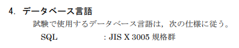
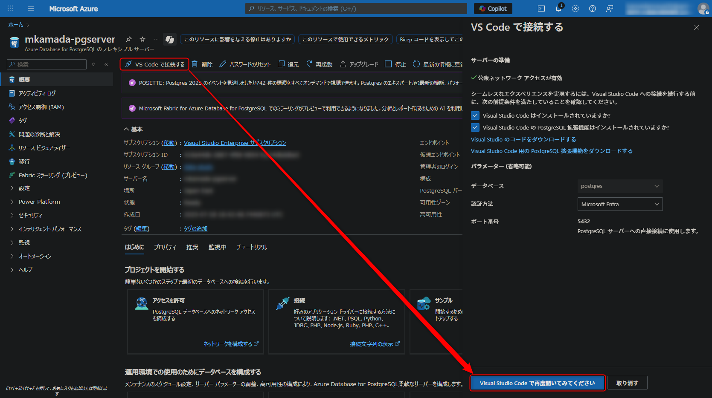

# データベーススペシャリスト試験 学習用データベース

このリポジトリは、データベーススペシャリスト試験の学習のために作成したデータベースプロジェクトです。
Azure PostgreSQLを使用して、実際の試験問題で想定されるデータベース構造を再現し、SQL実習を行うことができます。

## 試験情報

[試験で使用する情報技術に関する用語・プログラム言語など](https://www.ipa.go.jp/shiken/syllabus/gaiyou.html#yougo)

### 試験規格・仕様書

## セットアップ手順

### 1. Azure PostgreSQLデータベースの作成

1. Azureポータルで「Azure Database for PostgreSQL」を作成
2. 接続情報（サーバー名、ユーザー名、パスワード等）を控える

### 2. VS Codeからの接続

1. VS CodeでPostgreSQL拡張機能をインストール
2. Azure PostgreSQLに接続設定を行う

### 3. データベースセットアップ

`setup`ディレクトリ内のSQLファイルを1から順に実行：

1. `1-スキーマ.sql`
2. `2-会員.sql`
3. `3-商品.sql`
4. `4-商品種別.sql`
5. `5-売上.sql`
6. `6-売上明細.sql`

## 学習用SQLファイル

sqlディレクトリのSQLファイルは、実際の学習で使用したクエリです。
これらを参考に、データベーススペシャリスト試験のSQL問題を練習できます。

## データベーススペシャリスト試験 データ型一覧

試験で頻出するデータ型の概要です。

| データ型名 | 保存されるデータ | 詳細 |
|-----------|----------------|------|
| INTEGER | 整数 | 32ビット整数（-2,147,483,648 ～ 2,147,483,647） |
| CHAR(n) | 半角文字 | n文字の**固定長**。不足分は空白で埋められる |
| NCHAR(n) | 全角文字 | n文字の**固定長**。不足分は空白で埋められる |
| VARCHAR(n) | 半角文字 (可変長) | 最大n文字の**可変長**文字列 |
| NVARCHAR(n) | 全角文字 (可変長) | 最大n文字の**可変長**文字列 |
| TEXT | 長い文字列 | 大容量のテキストデータ |
| DECIMAL(p,s) | 固定精度小数 | p桁の数値、小数点以下s桁 |
| DATE | 日付 | 年月日（YYYY-MM-DD） |
| TIME | 時刻 | 時分秒（HH:MM:SS） |
| TIMESTAMP | 日時 | 日付と時刻の組み合わせ |
| BOOLEAN | 真偽値 | TRUE/FALSE |
| BLOB | バイナリデータ | 画像、音声などのバイナリファイル |

※ PostgreSQLでは最初からUnicodeを前提としているため、特にNCHARやNVARCHARは必要ありません。代わりにVARCHARを使用します。
